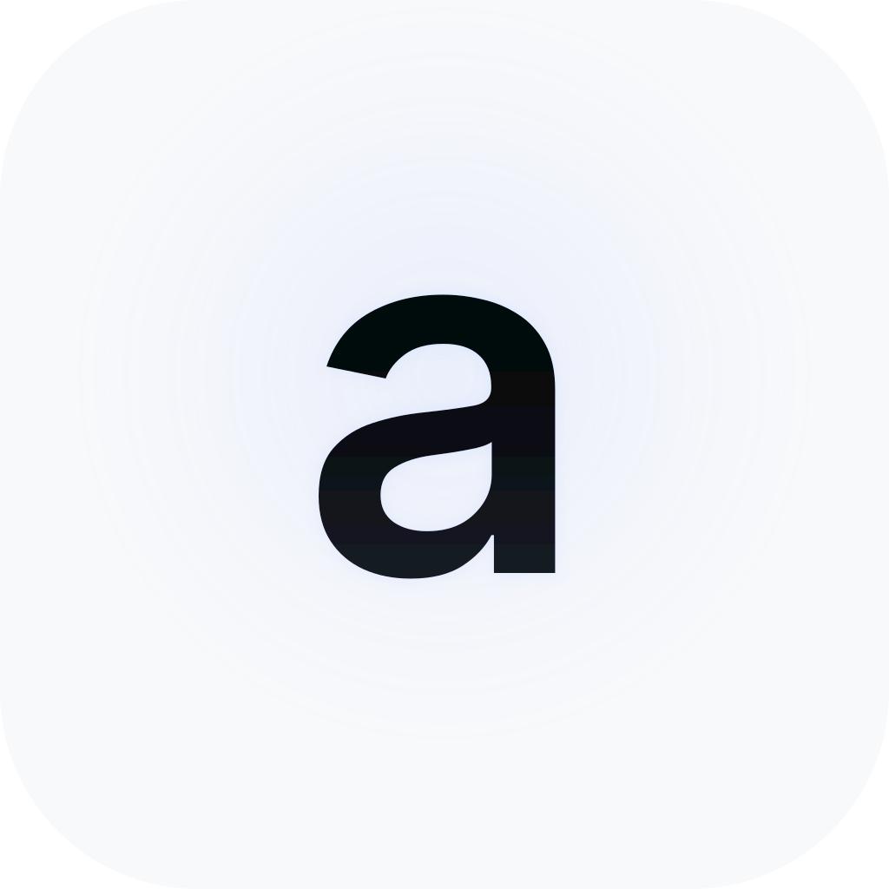
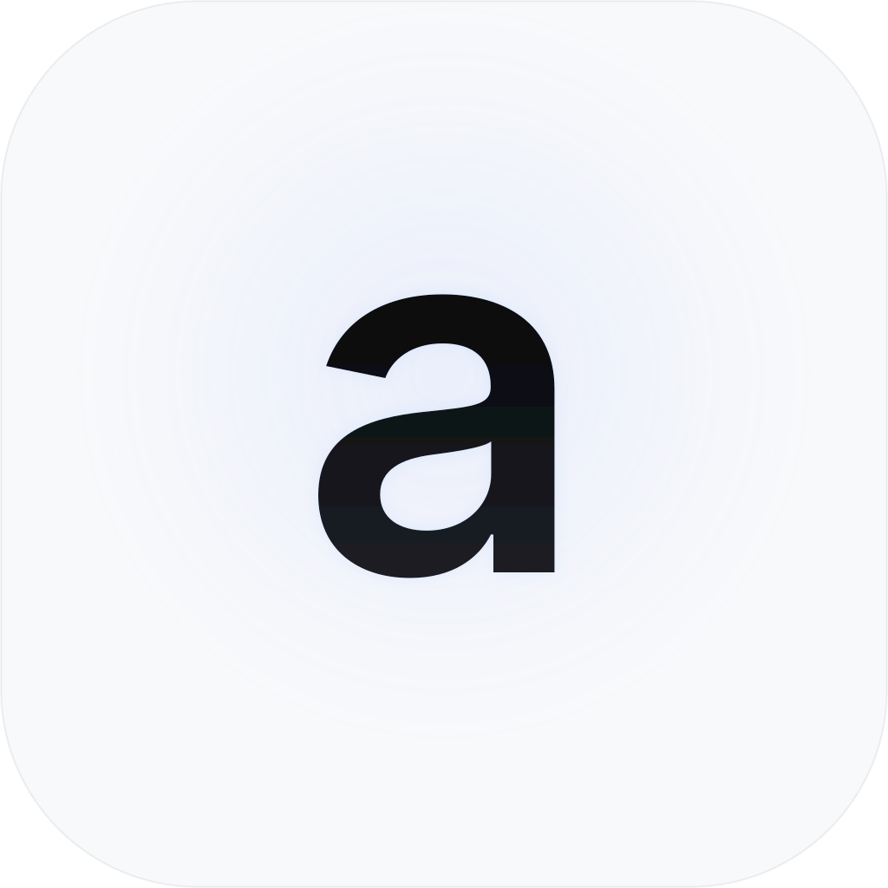

# Feature Test Document

This file tests all new ais features. Read each section and try the interactions described.

---

## External Links

These links should open in your **default browser**, never inside ais:

- [Google](https://www.google.com)
- [GitHub](https://github.com)
- [Anthropic Docs](https://docs.anthropic.com)
- [Rust Lang](https://www.rust-lang.org)
- [Go Playground](https://go.dev/play/)

If any of these navigate the webview instead of opening the browser, the feature is broken.

---

## Internal Links (Local Markdown)

These links should open as **new tabs** inside ais:

- [CLAUDE.md](CLAUDE.md)
- [Design Spec](spec/Design.md)
- [UX Spec](spec/ux.md)
- [Architecture](spec/Architecture.md)
- [Security](spec/Security.md)

---

## Anchor Links (In-Document Navigation)

Click these to scroll within this document:

- [Jump to Images Section](#images-local-and-external)
- [Jump to Highlights Section](#text-highlighting)
- [Jump to Checklist](#feature-checklist)
- [Back to Top](#feature-test-document)

---

## Images: Local and External

### Local Image (from project)

The ais app icon, loaded from the local filesystem:



The SVG version:



### External Images (from the internet)

A PNG from the web:


An SVG badge:


### Broken Image (error fallback test)

This image does not exist and should show the styled placeholder:


Another broken one with a descriptive alt text:


### Image Lightbox

Click any of the successfully loaded images above. A full-screen lightbox overlay should appear. Close it with:
- Click on the image
- Click on the dark overlay
- Press Escape
- Scroll

---

## Text Highlighting

Try highlighting text in this section using the Quick Action Bar:

1. **Select any text** below with your mouse
2. A floating bar with **6 colored dots** should appear above your selection
3. Click a dot to highlight the text in that color
4. Click on highlighted text to remove the highlight

### Practice Paragraphs

Lorem ipsum dolor sit amet, consectetur adipiscing elit. Sed do eiusmod tempor incididunt ut labore et dolore magna aliqua. Ut enim ad minim veniam, quis nostrud exercitation ullamco laboris.

Kubernetes provides a declarative API for managing containerized workloads and services. It automates deployment, scaling, and operations of application containers across clusters of hosts.

OpenShift extends Kubernetes with enterprise features including built-in CI/CD, monitoring, and security policies. It provides a complete platform for developing and deploying applications at scale.

Terraform enables infrastructure as code. You define your desired state in HCL configuration files, and Terraform determines what changes need to be made to reach that state.

### Highlight Colors Available

Try each color on a different paragraph:
- Yellow
- Green
- Blue
- Pink
- Purple
- Orange

Highlights persist across restarts. Close ais and reopen it to verify.

---

## Code Blocks

Code blocks should NOT be highlightable (the Quick Action Bar should not appear when selecting code):

```go
package main

import "fmt"

func main() {
    fmt.Println("Hello from ais!")
}
```

```yaml
apiVersion: apps/v1
kind: Deployment
metadata:
  name: ais
  labels:
    app: ais
spec:
  replicas: 3
```

---

## Feature Checklist

Use this checklist to verify all features:

### Links
- External links open in browser (not webview)
- Local .md links open as new tabs
- Anchor links scroll within the document
- External links show a subtle arrow indicator

### Images
- Local images render correctly
- External URL images load
- Broken images show styled placeholder with alt text
- Click on image opens lightbox
- Lightbox closes with Escape / click / scroll

### Highlights
- Quick Action Bar appears on text selection
- Bar disappears when selection is cleared
- All 6 colors work
- Click on highlighted text removes it
- Bar does NOT appear when selecting code
- Highlights persist after restart

### Window Behavior
- Window starts maximized
- Window is 100% opaque by default
- Settings changes persist after restart

### CLI
- `ais /path/to/file.md` opens the file directly

### File Watcher
- Edit this file externally and the content updates automatically in ais

---

> Built with ais -- Ambient Intuition Design
